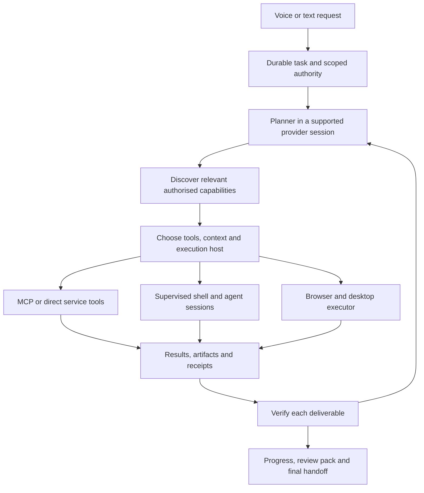

# PaneForge personal assistant orchestration and MCP

Research extension, 13 September 2026. This refines [the platform plan](assistant-platform-plan.md) and [experience specification](assistant-experience-design.md). It authorises no runtime installation, paid usage, or app implementation.

## The product Robert is describing

A persistent personal assistant that accepts an outcome, researches its context, chooses suitable tools, starts and steers agent or shell sessions, uses the right device, verifies deliverables, and returns an evidence-backed result. GPT-Live supplies the conversational voice experience. PaneForge owns the project, execution records, access scope, budgets and recovery.

It should autonomously choose among available authorised MCP capabilities. Robert should not have to pick an MCP server, create every terminal, move prompts between agents, or assemble their reports. Starting a shell session is an execution capability; publishing a website or deploying production remains a distinct external effect with its existing authority requirements.

The design objective is **reliable completion with efficient context**, not the smallest possible token count or the largest possible agent team. Mac first, Windows follows; use existing Claude/Codex subscriptions first and separately budget API features. Text operation remains available when voice is off.

## Architecture recommendation

This is a proposed responsibility map, not a diagram of implemented code. Preserve one authoritative task record across views and workers. Reuse the existing Assistant/Taskdriver scheduling and PaneForge session machinery where it meets the contract; decide ownership before introducing a new daemon. Do not run a competing hidden scheduler in each product.

Keep four identities distinct: the project/task, an execution attempt, the provider's conversation/session, and the OS process or terminal. A restarted attempt is not automatically a new project; a new voice conversation is not a new backend session. Persist their relationships so output returns to its owner after reconnection.

## What current protocols actually provide

| Surface | Verified capability | Consequence for this plan |
| --- | --- | --- |
| MCP tools | Model-controlled discovery/invocation; tool listing, schemas, structured results and resource links | Tools connect an agent to services. The host still supplies task orchestration and access enforcement. [^1] |
| OpenAI tool search | Deferred function/MCP discovery; hosted and client-executed lookup | The application can filter discovery by project/account. These documented API features are not proof of identical CLI capability. [^2] |
| Claude Code MCP | Tool search enabled by default on supported configurations; definitions deferred until needed | Reuse supported provider discovery instead of copying a whole catalogue into the prompt. Installed CLI here is 2.1.270; actual authenticated workflow remains untested. [^3] |
| Programmatic tool calling | JavaScript coordinates enabled tools and returns selected results | Useful for filtering/joining data. Hosted V8 is not Node, a general shell, or direct computer access. [^4] |
| OpenAI async tools | The model can continue while client-owned function/custom tools run; results retain call IDs | Application-owned jobs remain necessary. Current docs exclude combining these async tools with programmatic calling. [^5] |
| MCP Tasks | Experimental task lifecycle in the 2025-11-25 specification, negotiated per peer/tool | Do not assume every MCP server supports long jobs, cancellation or durable recovery. [^6] |
| Agent Client Protocol | Session creation, streaming updates, permissions and cancellation; optional resume and terminal capabilities | ACP connects a UI to an agent; MCP connects an agent to tools. Negotiate optional support rather than assume it. [^7] |

Version the protocol contracts used by each integration. The fetched MCP tools page is dated 2026-07-28; the Tasks evidence above is explicitly the older, experimental 2025-11-25 page, not an assertion of universal current implementation support. A protocol field does not establish that an installed worker implements it.

## How the assistant chooses MCP tools

Use a compact catalogue of configured capabilities: provider/server identity, short purpose, target account, supported device, authentication health, data scope and billing route. Start with a small curated set for the flagship workflow. A searchable vector database is unnecessary until ordinary metadata lookup proves insufficient.

For each stage, the host first excludes unauthorised accounts, disallowed data destinations, unavailable devices and unsupported billing routes. The planner then chooses among the remaining capabilities. Load the selected tools' complete schemas only when needed. Recheck authority and input validity at invocation, including when a tool was loaded in an earlier turn.

For example, “research this client brief” should initially expose relevant mail, client-folder and research capabilities. A later implementation stage may need a coding worker, filesystem, shell and browser inspection. The proof stage needs artifact creation and verification. There is no benefit in loading unrelated payment, social-posting and system-administration schemas into all three stages.

Prefer the most reliable suitable interface: a precise service tool for structured records; shell/code for files, builds and transformations; browser or native desktop control when the task requires that interface. This is a starting heuristic, not a rigid ranking. A poorly maintained MCP tool can be worse than a well-tested browser path. Compare outcome quality, latency, access scope and evidence.

Distinguish three actions in the product:

1. **Use:** choose an already configured, authorised tool for the current task without another generic permission prompt.
2. **Connect:** request a missing account/scope through a clear login or consent handoff.
3. **Add:** propose a new server or integration when the existing catalogue cannot meet the need. Review its source, version, licence, required access and cost before installing or executing unfamiliar code.

An MCP server's self-declared read-only annotation is a hint, not enforcement. Server descriptions, documents and tool results cannot grant new authority. Revocation must block actual execution even if an old schema remains in model context. The assistant may discover candidates on the web, but discovery is not permission to execute their installation commands.

Trusted local stdio servers can be started by a supervisor when needed; remote servers are connected over their supported transport. Do not launch a second identical server for every worker by default. Connection sharing must preserve account/task isolation, and idle cleanup must respect in-flight work. Measure startup latency and memory before choosing keep-alive policies.

## Context efficiency without losing work

Use staged discovery and selective retrieval, then evaluate code composition for predictable read/transform stages. Anthropic's engineering example demonstrates loading only relevant MCP interfaces and keeping bulky intermediate data in the execution environment. Its reported savings are specific to that example, not a PaneForge forecast. [^8]

Proposed context policy:

- Keep the objective, constraints, authority, active dependencies and evidence requirements readily available.
- Retrieve source passages and file ranges with their paths/IDs instead of repeating whole client folders or transcripts.
- Store complete task output and artifacts according to the agreed retention policy; show the model a bounded result with a retrievable artifact reference. Context reduction must not silently delete owned output.
- Return counts, selected records and failure details from predictable transformations. Preserve citations, source identity and completeness checks. A short answer that hides failed rows is not an optimisation.
- Give a child agent a bounded brief, relevant evidence, ownership and return criteria. Avoid cloning the entire parent transcript into every worker.
- Keep voice commentary short and based on observed task state. The voice layer does not need full terminal logs to explain progress.

Preserve provider-native continuity wherever supported. OpenAI's compaction API carries opaque prior state forward; its standalone compact result is the canonical next context window and must be passed on intact. Do not replace native continuity with a handwritten summary merely to save tokens. [^9]

A provider switch needs an explicit handoff containing objective, decisions, source references, artifacts, scope and outstanding work. An opaque OpenAI continuation cannot simply become a Claude continuation. Keep the original session available for return; label the switch and verify the new worker understood the bounded task.

Use direct calls where each result needs fresh judgment or the step changes external state. Use code composition where inputs and control flow are predictable and a smaller complete result can be returned. Preserve permissions at every nested call. API tool search occurs before a program that needs deferred tools, not from inside the already-running hosted program. These details are specific to the documented API route; do not project them onto every provider. [^4]

## Shell and worker sessions as first-class capabilities

The assistant should be able to request a terminal or agent session with a task purpose, owning workspace, device, scope, provider and budget. The supervisor resolves those requirements, starts the supported process, returns a durable handle, streams bounded output and records an exit or connection-loss state. The user can inspect the corresponding session in Workbench.

Use ordinary processes for noninteractive commands and real PTYs for interactive CLI sessions. Keep working directory, environment and credential scope explicit. Do not inherit unrelated API keys into a subscription worker. Use distinct worktrees for concurrent code writers and one owner for each browser/desktop input surface. A child must not obtain broader authority than its parent through a shell escape or alternate connector.

OpenAI documents local and hosted shell modes. Hosted shell does not provide interactive TTY sessions and is not Robert's Mac desktop. Local shell execution remains the application's responsibility. Therefore PaneForge's interactive agent terminals and device operations need supervised local/remote execution even if a hosted API shell is offered later. [^10]

The lifecycle must support create, inspect, steer where supported, await completion, interrupt/cancel, reconnect and archive. These are requirements, not a promise that every backend offers every operation. Interrupting a model, stopping a shell process tree and cancelling a remote job are separate events. Record acknowledgements and reconcile unknown states before retrying an action that might already have happened.

Independent work can continue while a worker runs or Robert signs in. Use event-driven progress, with bounded status retrieval where a protocol requires it. Do not consume repeated model turns just to ask whether a build is finished. Resource admission and task ownership belong outside the LLM so an enthusiastic planner cannot spawn unlimited workers.

Start with one capable coordinator and add workers only for independent work or a useful independent review. More agents can add duplicate research, token use and coordination delays. Keep the selected model family and the confirmed subscription-first policy. No unsupported route or exhausted plan may silently trigger paid API fallback.

## Open-source references worth evaluating

These are documented capabilities and architectural references, not installed or reproduced benchmarks. Pin revisions, licences and dependencies before code adoption.

| Candidate | Most useful evidence | Fit and limitation |
| --- | --- | --- |
| OpenClaw | Gateway owns sessions, nodes, scope, approvals and task/audit ledger surfaces | Closest reference for a personal assistant's persistent coordination. Study its contracts or evaluate as one worker backend; embedding the whole gateway risks duplicate scheduling and authority. [^11] |
| Goose | General-purpose Rust agent, desktop/CLI/API and MCP extensions; Apache-2.0 | Strong comparison for a reusable assistant runtime and native product. Adoption must earn its value against preserving existing PaneForge sessions. [^12] |
| Goose ACP providers | Pass extensions to coding agents as MCP servers; documents subscription routes | Particularly relevant to subscriptions-first. Current integration explicitly lacks session resume/fork and has different Goose/ACP IDs. Test recovery before considering it for long projects. [^13] |
| OpenHands SDK/server | Agent conversations, event streaming and workspace-backed execution | Candidate coding-worker contract. Current issue reports about MCP cleanup and async concurrency are test targets, not locally reproduced defects. [^14] |
| OpenCode | Coding agents with plan/build modes and subagents; MIT | Useful coding worker and interaction reference. Its README does not establish a complete personal-device/resource orchestrator. [^15] |

The strongest initial direction remains a thin PaneForge coordinator around supported Claude/Codex sessions and a small authorised tool catalogue, with selective browser/desktop execution from the original landscape. Compare Goose as an alternative in the same fixtures. Do not adopt a new general agent framework merely to gain a tool loop already supplied by a working subscription agent.

ACP is worth testing but does not itself grant subscription entitlements or guarantee parity with native provider protocols. Goose's documented subscription support is evidence about Goose's integration, not independent verification of PaneForge authentication. Prefer the supported route that preserves permissions, session state and recovery with the fewest translations.

## A concrete flagship execution

Robert says: “Take this accepted job through to a completed proof pack.” The assistant links the selected brief and client folder, retrieves existing context, and builds deliverable acceptance checks. It selects the relevant authorised mail/folder tools rather than asking Robert to configure a workflow graph.

For implementation it starts a supported coding session in the correct checkout. It can run independent research while that worker builds. If a client site requires login, it prepares the designated Chrome page and enters the existing user-sign-in wait state. It resumes only after account verification, preserving the original task and approval scope.

It chooses local or PC execution based on capabilities and measured headroom, not a blanket “remote is faster” rule. Browser inspection supplies evidence; service readbacks establish external effects. A separate bounded review checks the deliverables where worthwhile. The assistant then creates the private proof document and reports completed, blocked and unverified items honestly. Voice can be disconnected throughout without cancelling this project.

## Research-to-prototype acceptance gates

Use synthetic fixtures before real client data. Proposed counts below define a manageable experiment, not measured capability.

| Experiment | Comparison or fault | Required evidence |
| --- | --- | --- |
| Tool discovery | 20 representative tasks against 50 synthetic tools; full catalogue versus deferred discovery | Relevant-tool recall, wrong-account rejection, schema tokens, task success and latency |
| Context processing | Direct calls versus code-filtered results on a large brief/record fixture | Same required facts, source links, failed-item visibility and artifact completeness; total tokens and latency |
| Subscription session | Direct provider route versus eligible ACP integration | Real bounded authenticated request, billing identity, tool availability, resume/steer/cancel and rate-limit behaviour |
| Worker lifecycle | Start, interrupt, app restart and device disconnect during long work | Original IDs, preserved output, known/unknown process state, no duplicate effects or orphan growth |
| Tool lifecycle | Repeated connect/use/disconnect; revoke scope mid-task | Process/connection counts settle, no cross-account leakage, revoked tool cannot execute |
| Project delivery | Brief to artifact to proof pack with a login handoff | Correct client, scoped actions, complete evidence and no send/publish without authority |
| Resource pressure | Competing builds, desktop requests and provider limits | Queueing, one input owner, interactive responsiveness and no paid fallback |
| Context recovery | Compact or switch a worker with incomplete work | Objective, authority, artifacts and pending results retained; no repeated completed action |

Judge efficiency only after the same correctness and evidence standard is met. Record total input/output tokens, exposed cache usage, schema/result tokens where measurable, wall time, interventions, retries, memory/process peaks and actual billing route. Subscription quota telemetry may not expose precise per-task remaining capacity; label estimates.

Continuous improvement can test alternate tool descriptions, retrieval scope, routing and reusable procedures against these fixtures. Promote only demonstrated improvements with regressions and rollback recorded. Do not let the optimisation agent change its own evaluation criteria, budgets or authority to improve its score.

## Sources

[^1]: MCP, [Tools, 2026-07-28](https://modelcontextprotocol.io/specification/2026-07-28/server/tools).
[^2]: OpenAI, [Tool search](https://developers.openai.com/api/docs/guides/tools-tool-search).
[^3]: Anthropic, [Connect Claude Code to tools via MCP](https://code.claude.com/docs/en/mcp); local `claude --version` returned 2.1.270.
[^4]: OpenAI, [Programmatic tool calling](https://developers.openai.com/api/docs/guides/tools-programmatic-tool-calling).
[^5]: OpenAI, [Async tool calling](https://developers.openai.com/api/docs/guides/async-tool-calling).
[^6]: MCP, [Tasks, 2025-11-25](https://modelcontextprotocol.io/specification/2025-11-25/basic/utilities/tasks).
[^7]: ACP, [Protocol v1 overview](https://agentclientprotocol.com/protocol/v1/overview).
[^8]: Anthropic, [Code execution with MCP](https://www.anthropic.com/engineering/code-execution-with-mcp), 4 November 2025.
[^9]: OpenAI, [Compaction](https://developers.openai.com/api/docs/guides/compaction).
[^10]: OpenAI, [Shell](https://developers.openai.com/api/docs/guides/tools-shell).
[^11]: OpenClaw, [Gateway protocol](https://github.com/openclaw/openclaw/blob/main/docs/gateway/protocol.md).
[^12]: Goose, [Repository and licence](https://github.com/aaif-goose/goose).
[^13]: Goose, [ACP providers, subscription routes and limitations](https://goose-docs.ai/docs/guides/acp-providers/).
[^14]: OpenHands, [Software Agent SDK](https://github.com/OpenHands/software-agent-sdk), [Agent Server README](https://github.com/OpenHands/software-agent-sdk/blob/main/openhands-agent-server/openhands/agent_server/README.md), reported issues [MCP cleanup #2603](https://github.com/OpenHands/software-agent-sdk/issues/2603) and [async concurrency #4063](https://github.com/OpenHands/software-agent-sdk/issues/4063).
[^15]: OpenCode, [Repository and licence](https://github.com/anomalyco/opencode).

All sources accessed 13 September 2026. Source inspection and local version checks establish research evidence only. No new MCP server, ACP adapter, provider session, paid API call or third-party agent runtime was installed or executed for this extension.
