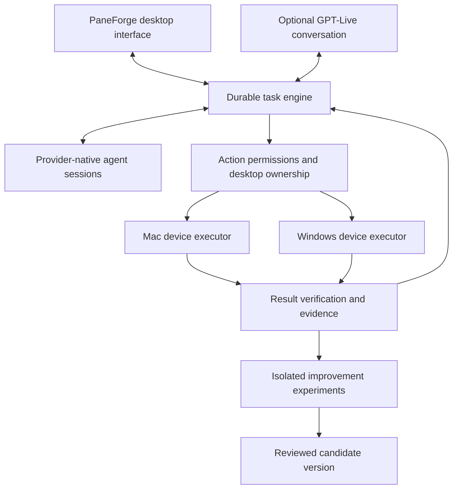

# PaneForge assistant platform

## Recommendation

Evolve PaneForge into a desktop assistant and agent workbench with a task engine that runs independently of its window. Use **Tauri 2 with the existing React interface as the leading shell candidate**, retain the working TypeScript agent/session logic during the first migration experiment, and evaluate Rust for the device host and measured performance bottlenecks. Do not combine a shell replacement, terminal replacement, provider rewrite, and visual redesign into one release.

The intended product is one place to speak, plan, execute, inspect results, and improve repeatable workflows across a Mac and Windows PC. A task should survive closing its view, reconnecting a device, changing the voice session, or replacing a model. Existing lanes, terminal sessions, remote ownership, question handling, and recovery are assets to preserve.

This is a research and design baseline, not an implementation approval or a claim of measured successor performance. Sources were checked on 13 September 2026. The confirmed delivery sequence is **Mac first, Windows follows**, retaining the existing PC worker where useful. **Subscriptions first, budget API extras** is the confirmed cost policy. Final visual direction and numerical spending limits remain decisions. The flagship scenario is an accepted client job progressing from its brief and existing context through authorised execution to a screenshot-backed completion document.

## What the earlier research establishes

Antigravity's local dossier, *PaneForge Architecture, Frontier Model Capabilities, and 1:1 Custom Harness Blueprint*, contains useful product ideas: a shared assistant/code workspace, clearer session states, visible device placement, and separation between presentation and execution. Its images are design references, not proof of implemented features or performance.

Several technical claims require correction:

| Earlier claim | Evidence-based correction | Planning consequence |
| --- | --- | --- |
| Claude Opus/Fable achieved the cited 99.9% ARC result | ARC Prize attributes 99.9% to GPT-6 Astra with its Provider Adapter harness. The standard-harness headline was 62.7%; these headline results also use different reasoning settings. [^1] | Preserve provider-native capabilities and compare configurations fairly. |
| The result was reproduced by a grid-to-Python synthesis loop | ARC-AGI-3 uses interactive environments. The supplied static demonstration-pair loop is not a reconstruction of that evaluation. [^1][^2] | Do not build a puzzle DSL as PaneForge's general task engine. |
| GPT Live is the older Realtime preview endpoint | GPT-Live has its own session API and delegates work to a separate backend. [^3][^4] | Design around the actual Live contract. |
| Live receives a screen/video stream | GPT-Live 1 accepts audio and text, not images/video. [^5] | Send screen observations to a suitable backend model, then return a concise result for speech. |
| Tauri guarantees roughly 40 MB and an easy migration | Tauri uses system webviews, but no comparable PaneForge prototype was supplied. [^6] | Treat memory savings and migration effort as hypotheses. |
| The Mac's lag is definitively unrelated to PaneForge | The dossier quotes a historical snapshot without attached profiling evidence. This investigation did not remeasure it. | Measure the full process tree, rendering, disk pressure, and agent workload together. |
| Hosting a pane on the PC offloads 100% of its resource use | Execution may be remote while rendering, transport, scrollback, and voice remain local. | Label execution location precisely; account for both devices. |

ARC Prize describes preservation of opaque reasoning state and compaction as the Provider Adapter distinction. Its separate PRO-LONG experiments also discuss generated tools, under different conditions. Neither establishes a general 99.9% success rate on ordinary computer work. The transferable hypothesis is that discarding a provider's context machinery can damage performance. It must be tested on PaneForge's workload. [^1]

## Product boundaries

The assistant should cover five concrete domains:

| Domain | Example outcome | Proof of completion |
| --- | --- | --- |
| Software delivery | Diagnose a bug, work in an isolated lane, produce a checked change | Reproduction, relevant tests, diff, commit and release state |
| Computer assistance | Change an authorised app setting or organise specified files | Readback from the target app/files, with a recovery record |
| Browser and service work | Prepare a report or complete an authorised workflow | Source identity, saved artifact or transaction receipt |
| Device resources | Place a heavy build on the PC while keeping the Mac responsive | Host receipt, process ownership, job result, local responsiveness |
| Continuous improvement | Improve a failing workflow without degrading existing ones | Baseline comparison, held-out results, review, rollback version |

“Anything on a computer” is the long-term direction, not a launch promise. Capabilities depend on OS permissions, app automation surfaces, signed-in accounts, available models, and reliable outcome checks. Unsupported applications should fall back to assisted operation with a clear explanation, rather than silently claim success.

Computer operation is optional in public distribution. Disabling it must prevent the device executor, capture, and control endpoints from running. Hiding a button is insufficient. Personal mode can enable explicitly chosen devices and capabilities while keeping all activity in the same workspace.

## Desktop technology decision

| Candidate | UI reuse | Main advantage | Main cost | Recommendation |
| --- | --- | --- | --- | --- |
| Electron + separated engine | Existing React/xterm retained | Smallest change; useful baseline | Bundled browser overhead remains | Keep as comparison and recovery path |
| Tauri 2 + React/xterm | Much of the renderer can remain | System webview; Rust host; gradual migration | Browser-engine differences and desktop integration work | Leading candidate, conditional on spike |
| Rust + GPUI | UI must be rewritten | Native Rust UI approach used by Zed | New UI implementation and framework integration risk | Reconsider only if webview tests fail or native requirements dominate |
| Flutter | UI/terminal integration must be rebuilt | Cross-platform desktop rendering | Dart/UI rewrite; existing web UI reuse falls sharply | Poor fit for the first migration |
| SwiftUI/AppKit | Mac UI rewrite | Direct Apple platform integration | Separate Windows UI required | More credible for Mac-first, but costly when Windows follows |
| Browser UI + device service | Web renderer retained | Remote access and shell independence | Browser lifecycle and desktop permission UX | Useful additional client, not the only desktop experience |

Tauri uses WKWebView on macOS and WebView2 on Windows. A bundled Node sidecar is supported, so retaining the current TypeScript execution logic is an available transition strategy rather than a forced Rust rewrite. The sidecar still consumes memory and needs lifecycle supervision. [^6][^7] GPUI is a Rust framework associated with Zed; Flutter officially supports desktop targets. These are credible alternatives, but neither preserves React components as native UI. [^8][^9]

Current source inspection at commit `3e52e5f5` found React 18, xterm.js, Electron 33, and `@lydell/node-pty`. `src/preload/index.ts` and `src/renderer/src/browserApi.ts` both build the API from `src/shared/surface.ts`. That transport boundary gives migration a useful starting point. However, `src/main/ipcTap.ts` still depends on Electron IPC, and desktop lifecycle, installers, updater, notifications, file drops, window behaviour, and permissions need inventory and replacement. Renderer reuse is not backend portability.

Keep node-pty for the first baseline if possible. Evaluate `portable-pty` separately; its cross-platform PTY API makes it a candidate, not proof of feature parity. [^10] Test Windows console behaviour, Unicode/IME, resize, paste, Ctrl-C, process trees, session resume, noisy output, and terminal search before committing to it.

Mac-first changes sequencing rather than removing Windows from the architecture. First prove Mac terminal, voice, desktop control and recovery; keep Windows interfaces narrow and specify compatibility fixtures early. A later Windows client must pass its own native integration gates before a cross-platform claim. Tauri remains the leading recommendation because Windows still follows and the React investment remains useful; a short native Mac comparison is appropriate if WKWebView fails the core experience tests.

## Proposed architecture

These are ownership boundaries, not a requirement to create a microservice for every box. Begin with the fewest processes that isolate UI responsiveness, task persistence, and device execution. Avoid a general plugin framework until there are actual independent integrations requiring it.

A task record should retain its goal, scope, device, working copy, provider session identity, lifecycle state, pending question, execution receipts, evidence, and budget. Reconnect must reconcile those records with the owning worker before starting anything again. Provider session identifiers remain opaque and provider-specific; switching providers is a documented handoff of task facts, not a claim to transfer hidden model state.

The window subscribes to task state and issues commands. It does not own long-running execution. One executor owns a task's process tree on a particular device. One controller owns physical input on a desktop at a time. Parallel jobs may use separate worktrees, explicit non-focusing browser sessions, or isolated virtual machines without assuming separate windows mean separate keyboards.

For actions, prefer a known API or CLI with an observable result. Use browser DOM or native accessibility automation where supported. Use visual computer control for interfaces that require it. A fallback changes the available capabilities and must still respect task scope and device ownership. It must not automatically bypass a login, CAPTCHA, or new permission boundary.

## GPT-Live, Astra, and provider integration

GPT-Live is a good fit for conversation that continues while work runs. For PaneForge, **client delegation** is the preferred design because the existing product needs to own routing, durable tasks, context, budgets, and result validation. Managed Responses delegation remains an alternative for a small standalone voice workflow. [^3][^4]

A proposed interaction is: “Check why my Mac is slow, put the next build on the PC, and tell me when it finishes.” The voice layer passes a task to PaneForge. The engine gathers authorised telemetry, selects a compatible host, starts or queues the build, and returns verified progress. The conversation stays available for questions and corrections. Actual resource changes depend on configured authority, not on whether the request arrived by voice.

In client mode, delegation metadata does not contain the user's task text. PaneForge must retain relevant transcript and application context and correlate updates with the delegation identifier. Keep detailed results and traces in the task engine, with brief factual updates supplied for speech. [^4]

Voice interruption, microphone mute, task pause, and task cancellation must be separate states. A spoken correction updates the active task version; late results from the previous version must not trigger actions. Transcript fragments are not completed user turns, and an acknowledgment does not prove the user heard a result. Ending a voice session does not, by itself, establish that client-managed work stopped. [^11]

GPT-Live 1's listed price is US$0.05 per minute of session duration, billed per second; backend work is separate. A 30-minute session is therefore US$1.50, one hour US$3, and an eight-hour connection US$24 before backend costs. These are arithmetic estimates from the published rate, not account-specific quotes. Use deliberate connection/disconnection rather than an always-connected voice session as the default. Image/video are unsupported by the voice model. [^5]

For screen understanding, deliver scoped screenshots or structured UI observations to the selected backend. OpenAI documents Astra computer use through code execution or structured computer actions and recommends code execution for Astra. PaneForge must supply the execution environment and action checks; choosing the model does not grant local desktop access. [^12]

Codex App Server exposes structured task interaction and ChatGPT-managed authentication, alongside API-key modes and rate-limit events. The installed CLI is `0.154.0`, and its help exposes `app-server` but labels it experimental. This establishes a local integration surface, not a completed integration or entitlement to every model/tool. Verify required session, steering, approval, cancellation, resume, and computer-use support against that installed protocol before adoption. [^13]

Do not assume the computer-use tools visible inside one hosted chat are automatically exportable to PaneForge. API access, CLI subscription access, and host-provided desktop tooling are separate. Preserve the chosen model family, discover actual capabilities at connection time, and label unsupported combinations clearly.

Claude and other providers need their own supported session contracts and authentication review. An installed CLI with supported automation may be usable within its plan; that does not authorise copying subscription credentials into a custom SDK or treating them as API keys. The first implementation spike must verify each route independently. No paid calls or authentication changes are part of this plan.

Enforce the confirmed cost policy before integration experiments: show the billing route before starting; use authorised subscriptions first; queue or use the other authorised subscription when capacity is exhausted. Never silently fall back to a paid API. Paid usage remains disabled until Robert sets a feature budget with session/task and daily limits. Account for voice duration and concurrent backend work; stop admitting paid work at the limit. Test metering delays and enforcement before real usage.

Claude Code documents programmatic `-p` execution and session continuation. Its `--bare` mode bypasses subscription OAuth/keychain authentication and requires API authentication, so it is not a shortcut for subscription routing. Verify the installed CLI's authentication and loaded tools with a bounded request before adoption. [^24]

## Open-source landscape

These are candidates and design references, not installed dependencies. Licences and default-branch claims were checked during this review; any adopted component needs an exact revision and dependency review.

| Project | Useful capability | Platform/limit | Disposition |
| --- | --- | --- | --- |
| Cua | Desktop/browser driver, SDK/MCP, VM and evaluation tooling | Native platform support plus VM options; not a complete voice assistant | Strong candidate for a bounded device-control experiment; core MIT, inspect optional dependencies [^14] |
| Agent S | Planner/grounder approach to GUI tasks | Mac/Windows/Linux; direct desktop/code actions need containment | Mine planning and observation patterns; Apache-2.0 [^15] |
| UI-TARS Desktop | Local/remote GUI operators and action inspection UX | Its desktop shell is Electron | Study operation visibility, not a replacement shell; Apache-2.0 [^16] |
| Open Interpreter Workstation | Local policies, long-running goals, host/renderer separation | Complete product stack, not a small drop-in library | Compare lifecycle and policy contracts; Apache-2.0 [^17] |
| Microsoft UFO | Windows native automation; multi-device coordination research | Windows executor does not provide Mac parity | Mine capability scheduling and Windows action adapters; MIT [^18] |
| Browser Use | Browser-specific agent execution | Not native desktop control | Candidate behind a browser boundary; MIT [^19] |
| OpenClaw | Personal assistant gateway, device nodes and channels | Not sufficient evidence of a complete desktop executor | Study gateway/node architecture; avoid importing an entire second control plane [^20] |
| screenpipe | Searchable screen/audio context and capture controls | Current source terms are not permissive commercial OSS | Product reference; do not embed code without resolving commercial licence requirements [^21] |

The best fit is selective reuse. Adopting a complete assistant product underneath PaneForge would duplicate scheduling, memory, approvals, and session identity. A small tested device driver or provider integration is easier to reason about and replace.

## Flagship workflow: accepted client job to proof document

The assistant should begin from an explicitly selected or authorised intake source: an email thread, an accepted Airtasker job, an attached brief, or an existing client folder. A new lead is not an accepted project, and a client message is task data rather than authority to expand access or spending. Start with a manual “Start project from this” action before adding automatic intake watchers.

Resolve the client and job identity before execution. Link the source thread/job, project folder, brief version, deliverables, exclusions, due date, connected accounts and prior approvals. Where an identity or scope is uncertain, ask one concrete question. Do not infer identity solely from a similar name or folder timestamp.

Research context in a deliberate order: existing client folder and approved project notes; the actual brief and attachments; relevant prior work and conversations within granted access; then public research needed to fill gaps. Build a brief matrix with one row per deliverable, its source, acceptance test, required access and evidence destination. Preserve source links and distinguish inferred requirements from explicit ones.

Each deliverable must record the source of its authority, target account and permitted external effects. Sending messages, publishing, ad spend, live site/CRM changes, deletion and production release require their corresponding scoped authority. Successful sign-in grants access, not permission for every account operation.

Before real client trials, define a client-data boundary: credentials/tokens belong in the OS credential vault, not transcripts; task data and evidence need restricted access and encryption appropriate to local/remote storage. Define permitted providers/devices per client, minimise and redact transmitted context, and set retention/deletion rules for captures, traces and proof packs. Project evidence must not silently become cross-client memory or training data. Validate using synthetic fixtures first.

The assistant proposes a task plan and executes already authorised, reversible steps. For missing access, it prepares the correct login page in the designated Chrome automation session, clearly identifies the account/site needed, and waits for the owner to sign in. The default for this flagship flow is Chrome as requested; another browser is used only when requested or technically necessary and disclosed. Credentials and MFA are entered directly into the site, never into the conversation, screenshots, logs or persistent memory.

While waiting, independent research or local preparation continues. An authenticated-looking screen is not sufficient: after login, recheck the target account and permitted project, then resume the original task. Capture/input automation must pause around credential entry. Requesting a login does not authorise changing authentication or security settings.

Represent login handoff as `waiting_for_user_sign_in`. Release input ownership and suspend automated focusing, typing and capture in the sign-in scope. User acknowledgement resumes account verification and reconciliation before dependent actions. Timeout or abandonment leaves the step blocked, without autonomous login retries or loss of independent completed work.

Execute in bounded stages with visible outcomes. Keep browser ownership and task identity stable. Save artifacts in the client folder, read back writes, verify affected behaviour, and attach evidence to the relevant deliverable. If a required step is blocked, retain completed work and explain the specific missing input. Do not conceal a partial result inside a broad “project complete” message.

The completion document should contain the agreed goal, a short outcome statement, a deliverable-by-deliverable result table, readable screenshots of the actual finished state, links to artifacts, verification notes, and remaining client actions. A screenshot proves only what it shows: a filled form does not prove submission, a saved setting does not prove the whole workflow, and a filename does not prove the correct client. Redact sensitive data and exclude login screens.

Acceptance evidence follows the effect: local preparation requires the saved artifact and content check; sending requires a provider receipt or sent-state readback; publishing requires target readback and changed behaviour; remote record changes require the correct account/record readback. Missing proof leaves the result unverified even when a tool returns success.

The final handoff is a private review pack and optional prepared draft. Email sending, public publishing and production release retain their explicit approval boundaries. “Build the whole project” covers the agreed work, not unlimited external acts. Recurring automation should be added only after the manual flagship path is reliable and duplicate-safe.

The visual reference supplied for this experience is [the YouTube segment starting at 4:00](https://www.youtube.com/watch?v=kP31sQPAJm0&t=240s). Metadata was retrieved, but the bounded segment download returned HTTP 403. Exact visual observations remain unverified; the intended conversational behaviour above comes from the stated requirements and is not attributed to an unwatched video.

## Resource management

Treat lag as a system problem to diagnose. Measure UI input/frame latency, shell and webview memory, agent child processes, build peaks, disk latency, swap/compression, GPU load, and host availability. Do not use “RAM used” alone as the scheduling signal, and do not sum overlapping memory metrics into a misleading total.

A proposed scheduler prefers the PC for compatible heavy work, keeps interactive rendering on the Mac, and reserves headroom based on observed workload peaks. macOS-specific builds remain on a Mac. Linux/WSL/container paths and native Windows paths require explicit capability labels. Remote execution does not automatically move an existing process or its open handles.

Under pressure, first stop admitting additional heavy jobs. Queue them with a visible reason, offload new compatible work, and sleep only resumable idle sessions whose state was durably saved. Preserve active work and unsaved output. Do not kill unrelated browsers or user processes to meet an arbitrary memory target.

When the PC disconnects, show “connection lost, execution status unknown” until reconciliation. A local timeout is not evidence that the remote task stopped. A restarted engine must recover the existing task rather than duplicate it. A device return should refresh process identity, repository state, permissions, and available capacity.

## Continuous improvement

The product can improve its code, prompts, skills, routing, and recovery policies. It cannot silently rewrite the underlying proprietary model weights. Improving these surrounding components is valuable only when task outcomes improve under comparable conditions.

Use this loop: capture a consented failure trace, reproduce it on fixtures, propose one bounded change, run baseline and candidate, review the evidence, promote within release authority, observe, and retain rollback. Failed experiments become evidence rather than new permanent complexity.

Separate three cadences: per-task recovery; scheduled evaluation of bounded workflow improvements; and reviewed application releases. Researching new models or repositories should create candidates, not automatically install the latest dependency. Pin the runtime, model configuration, tool permissions, prompts, and evaluator version for comparisons.

OpenHands provides reusable software-agent and benchmark patterns; BrowserGym provides repeatable browser environments. They are useful reference infrastructure, not proof that arbitrary desktop tasks can be reliably scored. [^22][^23] PaneForge needs its own fixtures covering its actual workflows.

Start with a proposed 30-task suite: 10 software delivery tasks, 6 browser tasks, 6 native desktop tasks split across Mac/Windows, 4 resource/recovery tasks, and 4 voice/steering tasks. Include refusal and cancellation cases. This count is a proposed initial test budget, not an existing measured corpus. Grow it from real failures and keep held-out variants unavailable to the optimiser.

Record verified success, false success, human interventions, elapsed time, API cost, subscription consumption where exposed, memory/CPU peaks, recovery success, duplicate effects, and permission violations. Compare both median and tail latency. Repeat nondeterministic tasks; a small pass-rate increase on one run is not enough evidence to promote.

An evaluator must check saved outcomes, not reward an agent for saying “done.” Keep evaluation fixtures and promotion rules protected from the candidate being tested. Use independent review for ambiguous outputs and preserve human judgement for aesthetics. No automatic promotion may expand permissions, spend, credential access, data retention, or release authority.

## Migration and validation sequence

| Gate | Work after implementation approval | Exit evidence |
| --- | --- | --- |
| 0. Product contract | Agree initial tasks, platforms, privacy, costs and design direction | Explicit decisions and acceptance scenarios |
| 1. Baseline | Measure current PaneForge on representative idle, busy and recovery workloads | Reproducible Mac/PC measurements and process inventory |
| 2. Shell experiment | Existing React screen and one real terminal in Tauri, retaining execution where feasible | Mac input, resize, search, clipboard, IME, high-output and wake tests; Windows parity fixtures specified |
| 3. Engine separation | Move durable task/session ownership outside window lifecycle | Close/reopen/reconnect without duplicate or lost tasks |
| 4. Assistant experiment | Text request, one device executor, then GPT-Live client delegation | Verified action, interruption, denial, cancellation and voice result |
| 5. Resource policy | Capacity-aware admission and remote placement | Pressure/disconnect tests; unrelated work preserved |
| 6. Improvement lab | Frozen baseline, candidate, held-out scoring and rollback | Reproducible better outcome within budget, no critical regression |
| 7. Mac private pilot | Daily use on test profiles; client-job fixture and data migration rehearsal | Long-running Mac stability, proof-pack quality and recovery evidence |
| 8. Windows follow-up | Port and test the Windows client/device integrations | Native console, input, voice, permissions, installer and recovery parity |
| 9. Public readiness | Capability-off packaging, updates, onboarding and licensing | Disabled control truly inactive; signed distribution and rollback tests |

Benchmark Electron and Tauri with the same UI, terminal buffers, transcript workload, agent count and job mix. Measure idle, 4/8/16 displayed sessions where hardware permits, noisy output, a large transcript, a heavy local build, a remote build, sleep/wake, and an extended soak. Fix the observed current bottleneck if switching shells does not improve it.

Provisional performance objectives are lower total application memory than the equivalent Electron baseline, no regression in terminal correctness, responsive interaction during output bursts, and stable recovery. Set numerical budgets after baseline measurement. The earlier 40 MB claim and “zero latency” phrase are not acceptance criteria.

Migration must preserve configuration, histories, worktrees, queued prompts, provider resume IDs, remote pairing, and the installed app's data identity. Rehearse on a duplicate profile, retain recoverable old data, and define forward/backward schema compatibility. Updating a shell must not terminate running tasks without a verified handoff. No production migration is authorised by this document.

## Decisions still open

1. Mac-first is confirmed; specify the minimum PC-worker compatibility that must remain during the Mac transition.
2. Accepted client job to proof document is the flagship scenario; choose the first concrete client-task fixture and two supporting resource/development tasks.
3. What session/daily/monthly limits should apply to paid voice and API work, and what happens when a limit is reached?
4. Should screen context be task-scoped only, or eventually include separately opted-in historical capture? Task-scoped is the initial recommendation.
5. Is Antigravity's dense, glowing dark design the preferred direction, or should the workspace be calmer and lighter in visual weight? The companion design brief proposes the latter without discarding the existing identity.
6. Which low-risk improvements may later promote automatically, and which require review? Until defined, experiments can produce candidates but do not grant themselves release authority.

Keep **PaneForge** as the working name during validation. An assistant view named “Forge” could broaden the experience without a disruptive rename. Neither that name nor any alternative has trademark/domain clearance; branding should follow the validated product rather than delay architecture research.

## Sources

[^1]: ARC Prize / Greg Kamradt. [OpenAI's GPT-6 Astra on ARC-AGI-3](https://arcprize.org/blog/astra), 3 September 2026.
[^2]: ARC Prize. [ARC-AGI-3 Technical Report](https://arcprize.org/media/ARC_AGI_3_Technical_Report.pdf); ARCAGI-Labs, [benchmarking repository](https://github.com/ARCAGI-Labs/arc-agi-3-benchmarking).
[^3]: OpenAI. [Getting started with GPT-Live](https://developers.openai.com/api/docs/guides/live), current documentation, accessed 13 September 2026.
[^4]: OpenAI. [Delegation and tools in GPT-Live](https://developers.openai.com/api/docs/guides/live-delegation), current documentation, accessed 13 September 2026.
[^5]: OpenAI. [GPT-Live 1 model, modalities and pricing](https://developers.openai.com/api/docs/models/gpt-live-1), accessed 13 September 2026.
[^6]: Tauri. [Process Model](https://v2.tauri.app/concept/process-model/), accessed 13 September 2026.
[^7]: Tauri. [Embedding External Binaries](https://v2.tauri.app/develop/sidecar/), accessed 13 September 2026.
[^8]: Zed. [GPUI](https://gpui.rs/) and [GPUI README](https://github.com/zed-industries/zed/blob/main/crates/gpui/README.md), accessed 13 September 2026.
[^9]: Flutter. [Desktop support](https://flutter.dev/development/desktop), accessed 13 September 2026.
[^10]: WezTerm / portable-pty. [Rust API documentation](https://docs.rs/portable-pty/latest/portable_pty/), accessed 13 September 2026.
[^11]: OpenAI. [Managing GPT-Live sessions](https://developers.openai.com/api/docs/guides/live-conversations), accessed 13 September 2026.
[^12]: OpenAI. [Computer use](https://developers.openai.com/api/docs/guides/tools-computer-use), accessed 13 September 2026.
[^13]: OpenAI. [Codex App Server](https://learn.chatgpt.com/docs/app-server), accessed 13 September 2026; local `codex --version` and `codex app-server --help`.
[^14]: Cua. [Source and project documentation](https://github.com/trycua/cua), accessed 13 September 2026.
[^15]: Simular. [Agent S](https://github.com/simular-ai/Agent-S), accessed 13 September 2026.
[^16]: ByteDance. [UI-TARS Desktop](https://github.com/bytedance/UI-TARS-desktop), accessed 13 September 2026.
[^17]: Open Interpreter. [Interpreter Workstation](https://github.com/openinterpreter/interpreter-workstation), accessed 13 September 2026.
[^18]: Microsoft. [UFO](https://github.com/microsoft/UFO), accessed 13 September 2026.
[^19]: Browser Use. [Source and documentation](https://github.com/browser-use/browser-use), accessed 13 September 2026.
[^20]: OpenClaw. [Source and documentation](https://github.com/openclaw/openclaw), accessed 13 September 2026.
[^21]: screenpipe. [Source and licensing notice](https://github.com/screenpipe/screenpipe), accessed 13 September 2026.
[^22]: OpenHands. [Software Agent SDK](https://github.com/OpenHands/software-agent-sdk) and [benchmarks](https://github.com/OpenHands/benchmarks), accessed 13 September 2026.
[^23]: ServiceNow. [BrowserGym](https://github.com/ServiceNow/BrowserGym), accessed 13 September 2026.

[^24]: Anthropic. [Run Claude Code programmatically](https://code.claude.com/docs/en/headless), accessed 13 September 2026.

Private references: Antigravity dossier and design image in conversation artifact directory `5e2fde8a-2ca8-48ad-8601-37b36c5b5119`; PaneForge source files cited above, read at `3e52e5f5`. Dossier profiling figures were not independently remeasured. External project demonstrations were reviewed as documentation, not reproduced on either device.
